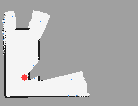
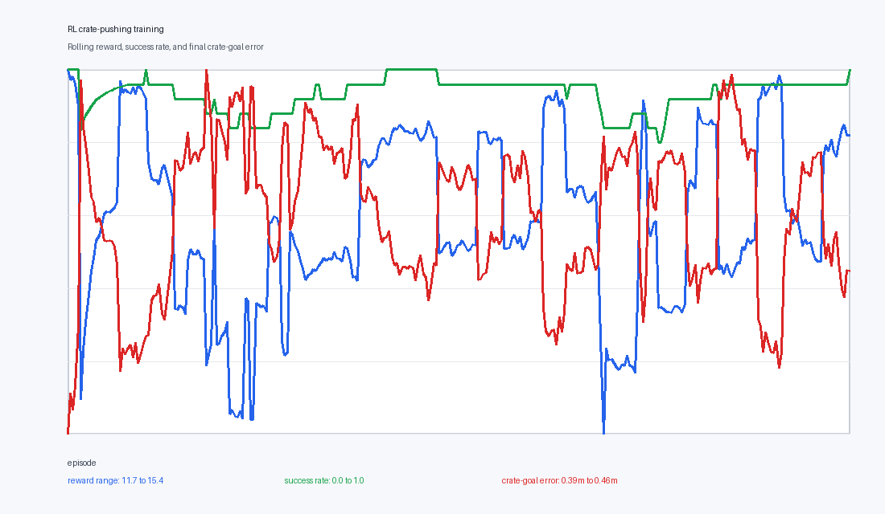
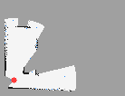

# Isaac Warehouse SLAM + RL Crate Pushing

An Isaac Sim robotics portfolio project where a JetBot-style differential-drive robot maps a warehouse, plans through clutter, detects a movable supply crate, and switches to a learned Q-learning policy for local crate pushing.

The core autonomy stack is pure Python and simulator-independent, so it can be tested quickly offline. The same mission logic then runs in Isaac Sim with a live warehouse scene, RGB/depth camera, RTX LiDAR prim, IMU/contact sensor bridges, a movable crate, and a goal zone.



## Why This Is Robotics/AI-Relevant

- **Model drives action:** a trained Q-table policy controls the local crate-pushing behavior once the robot reaches the interaction zone.
- **Multi-sensor robotics stack:** LiDAR range scans, camera detections, IMU yaw-rate, and bumper contact feed mapping and mission logic.
- **SLAM and planning:** odometry/IMU prediction, local correlative scan matching, log-odds occupancy mapping, frontier exploration, and A* navigation.
- **Sim interaction:** the robot physically interacts with a movable crate in Isaac Sim instead of only navigating to waypoints.
- **Reproducibility:** deterministic offline simulator, tests, metrics JSON, telemetry CSVs, maps, and Isaac smoke-run artifacts are included.

## Result Snapshot

| Capability | Evidence |
| --- | --- |
| RL local crate pushing | 96.7% greedy evaluation success over 30 held-out randomized starts |
| Learned policy size | 157 visited discrete Q states after 300 Q-learning episodes |
| Offline SLAM + RL mission | Crate reached the goal at step 67 in `rl_push_crate` mode |
| Isaac Sim headed smoke run | Created RGB/depth camera, RTX LiDAR prim, IMU/contact bridges, loaded the learned policy, ran 120 headed steps, and saved fresh map/telemetry artifacts |
| Test coverage | Unit tests cover grid mapping, scan matching, planning, RL, and the offline sim loop |



## Quickstart

From this folder:

```powershell
python -m pip install -e ".[dev]"
python -m pytest -q
python -m ruff check .
```

Run the deterministic offline SLAM + RL mission:

```powershell
python scripts\run_offline_slam_demo.py --steps 500 --rl-policy artifacts\rl_push_q_table.json
```

Regenerate the RL policy and training curve:

```powershell
python scripts\train_rl_push_policy.py --episodes 300 --eval-episodes 30 --seed 7 --max-steps 80
python scripts\render_rl_curve.py
```

Check whether local/Kaggle compute is available:

```powershell
python scripts\check_compute.py --kaggle --json-out artifacts\compute_status.json
```

## Isaac Sim Run On Windows

Isaac Sim 6.0 requires Python 3.12. This project has been validated with a short Windows-native Isaac environment at `C:\iw`, which avoids the current WSL virtualization blocker.

Install path used locally:

```powershell
$env:OMNI_KIT_ACCEPT_EULA="YES"
C:\Users\arnav\.local\bin\uv.exe venv C:\iw --python 3.12
C:\iw\Scripts\python.exe -m pip install "isaacsim[compatibility-check]==6.0.0.1" --extra-index-url https://pypi.nvidia.com
C:\iw\Scripts\isaacsim.exe isaacsim.exp.compatibility_check --/app/quitAfter=20 --no-window --/renderer/multiGpu/enabled=false
C:\iw\Scripts\python.exe -m pip install "isaacsim[all,extscache]==6.0.0.1" --extra-index-url https://pypi.nvidia.com
C:\iw\Scripts\python.exe -m pip install -e ".[dev]"
```

Headless smoke run:

```powershell
$env:OMNI_KIT_ACCEPT_EULA="YES"
C:\iw\Scripts\python.exe scripts\run_isaac_warehouse_slam.py --headless --steps 100 --save-map-every 0 --rl-policy artifacts\rl_push_q_table.json
```

Headed demo run:

```powershell
$env:OMNI_KIT_ACCEPT_EULA="YES"
C:\iw\Scripts\python.exe scripts\run_isaac_warehouse_slam.py --headed --steps 300 --save-map-every 150 --rl-policy artifacts\rl_push_q_table.json
```

The Isaac runner writes:

- `artifacts/isaac_final_map.png`
- `artifacts/isaac_telemetry.csv`
- optional `artifacts/isaac_map_step_*.png`



## Project Layout

- `src/warehouse_slam/grid_map.py` - log-odds occupancy grid and frontier extraction.
- `src/warehouse_slam/slam.py` - odometry/IMU prediction plus LiDAR scan-match correction.
- `src/warehouse_slam/scan_matching.py` - local correlative scan matcher.
- `src/warehouse_slam/planning.py` - A* planner and frontier goal selection.
- `src/warehouse_slam/rl.py` - Q-learning environment, policy, evaluation, and JSON persistence.
- `src/warehouse_slam/mission.py` - exploration, crate approach, and push-crate mission modes.
- `src/warehouse_slam/sim2d.py` - deterministic offline warehouse simulator.
- `scripts/run_isaac_warehouse_slam.py` - Isaac Sim scene and multi-sensor runner.
- `scripts/train_rl_push_policy.py` - trains/evaluates the crate-interaction policy.
- `scripts/check_compute.py` - probes local RTX/Kaggle compute status.
- `docs/PORTFOLIO_BRIEF.md` - one-page internship project brief.
- `docs/DEMO_CAPTURE.md` - headed demo capture checklist.

## Compute Notes

Local RTX 3080 Ti is the primary compute lane for Isaac Sim. Kaggle is optional for future perception-model training or sweeps, not for interactive Isaac Sim. See `docs/COMPUTE.md`.

WSL is not the current default because Windows previously reported:

```text
Wsl/Service/CreateInstance/CreateVm/HCS/HCS_E_HYPERV_NOT_INSTALLED
```

After enabling virtualization in firmware and Windows' Virtual Machine Platform feature, the WSL helper scripts can be used:

```bash
bash scripts/install_isaac_wsl.sh
bash scripts/run_headed_wsl.sh
```

## Resume Bullets

- Built an Isaac Sim warehouse autonomy stack where a differential-drive robot fuses LiDAR, RGB/depth camera detections, IMU yaw, and bumper contact to perform occupancy-grid SLAM, frontier exploration, A* navigation, and learned local crate pushing.
- Trained and evaluated a Q-learning crate-interaction policy with 157 discrete Q states, reaching 96.7% held-out success across randomized starts and integrating the policy into the same mission loop used by the Isaac Sim robot.

## References

- NVIDIA Isaac Sim Python install docs: https://docs.isaacsim.omniverse.nvidia.com/6.0.0/installation/install_python.html
- NVIDIA Isaac Sim RTX sensors docs: https://docs.isaacsim.omniverse.nvidia.com/latest/sensors/isaacsim_sensors_rtx.html
- NVIDIA Isaac ROS visual SLAM with Isaac Sim tutorial: https://nvidia-isaac-ros.github.io/concepts/visual_slam/cuvslam/tutorial_isaac_sim.html
